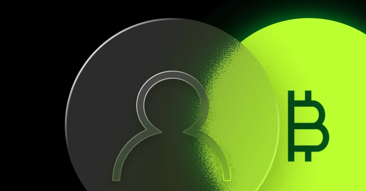
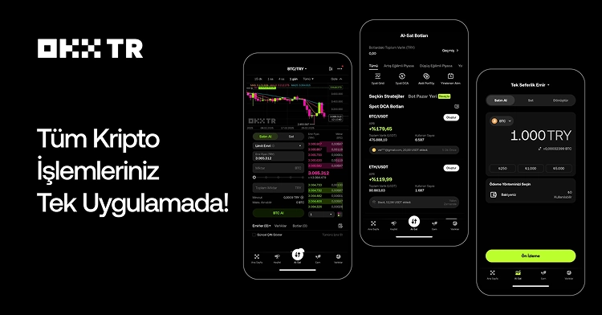

# OKX TR'de İşlem Yapmaya Başladığınızda Ödül Kazanın

---

Kripto para dünyasına yeni adım atıyorsanız ya da mevcut borsanızdan daha iyi koşullar arıyorsanız, doğru yerdesiniz. OKX borsası, kimlik doğrulaması olmadan hesap açmanıza ve 2.000 dolara kadar airdrop kazanmanıza olanak tanıyor. Bu rehberde, OKX'te nasıl başlayacağınızı, ödülleri nasıl alacağınızı ve işlemleri nasıl gerçekleştireceğinizi adım adım göreceğiz.

---

## OKX Nedir ve Neden Tercih Edilmeli?

OKX (eski adıyla OKEX), dünya çapında milyonlarca kullanıcısı olan köklü bir kripto para borsası. Peki sizi diğer borsalardan ayıran özellikleri neler?

**Kimliksiz İşlem Yapabilme:** Bazı temel işlemler için kimlik doğrulaması gerekmez. Bu, hızlı başlamak isteyenler için büyük kolaylık.

**Airdrop Fırsatları:** Yeni kullanıcılara özel olarak 2.000 dolara kadar airdrop veriliyor. Evet, yanlış duymadınız - sadece kayıt olup birkaç basit görevi tamamlayarak bedava kripto kazanabilirsiniz.

**Geniş Coin Çeşitliliği:** Bitcoin ve Ethereum'dan tutun da daha az bilinen altcoin'lere kadar yüzlerce farklı kripto paraya erişim.

**Kullanıcı Dostu Arayüz:** İster yeni başlayan olun ister deneyimli bir trader, arayüz sezgisel ve kullanımı kolay.

## Nasıl Başlanır? Adım Adım Kayıt

Kayıt işlemi oldukça basit. İşte yapmanız gerekenler:

1. **Referans Linki ile Kayıt Olun:** Airdrop'tan faydalanmak için mutlaka bir referans kodu kullanmalısınız. 👉 [Hemen OKX'e kaydolun ve ödüllerinizi kazanmaya başlayın](https://www.okx.com/join/62834398)

2. **E-posta veya Telefon Numarası:** Hesabınızı oluşturmak için bir e-posta adresi ya da telefon numarası yeterli.

3. **Güçlü Bir Şifre Belirleyin:** Hesap güvenliğiniz için karmaşık bir şifre kullanın.

4. **Doğrulama:** E-postanıza veya telefonunuza gelen kodu girin.

İşte bu kadar! Artık OKX'te bir hesabınız var.

## Airdrop Nasıl Kazanılır?

Kayıt olduktan sonra sıra ödülleri kazanmaya gelir. İşte yapmanız gereken birkaç basit görev:

**Görev 1: İlk Giriş Ödülü**
Hesabınıza ilk kez giriş yaptığınızda otomatik olarak bir miktar kripto kazanırsınız. Bu genellikle birkaç dolar değerinde olur.

**Görev 2: İşlem Yapma**
Küçük bir işlem gerçekleştirin. Örneğin, 10-20 dolar değerinde bir alım-satım yapmanız yeterli. Bu işlemi yaptığınızda bonus kazanırsınız.

**Görev 3: Staking Ödülleri**
Bazı coinleri kilitleyerek (staking) ekstra kazanç elde edebilirsiniz. Ancak dikkat: Kilitlediğiniz coinler belirli bir süre boyunca çekilemez. Örneğin, 1 yıllık kilitleme seçeneği seçerseniz, o süre boyunca paranıza dokunamazsınız.

**Görev 4: Arkadaş Davet Et**
Siz de başkalarını davet ederek ekstra ödüller kazanabilirsiniz. Her davet ettiğiniz kişi işlem yaptığında sizin de cüzdanınıza bonus düşer.

## Para Çekme İşlemi Nasıl Yapılır?

Kazandığınız kripto paraları çekmek istediğinizde yapmanız gerekenler:

1. **Cüzdan Adresinizi Hazırlayın:** Öncelikle paranızı göndereceğiniz bir cüzdan adresine ihtiyacınız var. Binance, Metamask gibi başka bir cüzdanınız olmalı.

2. **Withdraw (Çekme) Bölümüne Gidin:** OKX'te "Assets" veya "Varlıklar" bölümüne tıklayın, ardından "Withdraw" seçeneğini bulun.

3. **Coin Seçin:** Hangi kripto parayı çekmek istiyorsanız onu seçin (örneğin BTC, ETH, DOT).

4. **Adres ve Miktar:** Hedef cüzdan adresinizi girin ve çekmek istediğiniz miktarı yazın.

5. **Network Seçimi:** Çok önemli! Doğru network'ü (ağ) seçmelisiniz. Yanlış network seçimi paranızın kaybolmasına neden olabilir.

6. **Onaylayın:** İşlemi onaylayın ve e-posta/SMS ile gelen kodu girin.

**Pro İpucu:** İlk çekme işleminizi küçük bir miktar ile test edin. Eğer para başarıyla ulaşırsa, daha büyük miktarları çekebilirsiniz.

## Gerçek Kullanıcı Deneyimleri

Forum üyelerinden biri şöyle demiş: "5 dolar DOT kazandım, az ama hiç yoktan iyidir!" 

Başka bir kullanıcı: "Ben parayı çekmek yerine hesapta tutup kilitleme (staking) yapıyorum. Az da olsa değerleniyor."

Görüyorsunuz ki, kazanılan miktarlar değişkenlik gösteriyor. Bazıları 1 dolar, bazıları 5 dolar kazanmış. Ama hepsi ortak bir noktada birleşiyor: **Hiç risk almadan bedava kripto kazanmak mümkün.**

## Dikkat Edilmesi Gerekenler

**Kilitleme Süreleri:** Eğer staking yapmaya karar verirseniz, kilitleme sürelerine dikkat edin. Özellikle 1 yıllık seçenekler paranızı uzun süre bloke eder.

**Network Seçimi:** Para çekerken mutlaka doğru network'ü seçin. Bu konuda emin değilseniz, internetten araştırma yapın veya küçük bir test çekimi yapın.

**Referans Kodu:** Airdrop kazanmak için mutlaka bir referans kodu kullanmalısınız. Kod: **62834398**

**Güvenlik:** İki faktörlü doğrulamayı (2FA) mutlaka aktif edin. Bu, hesabınızın güvenliğini önemli ölçüde artırır.

## Sıkça Sorulan Sorular

**Kimlik doğrulaması yapmak zorunda mıyım?**
Hayır, temel işlemler için kimlik gerekmez. Ancak yüksek limitlerle işlem yapmak isterseniz KYC (kimlik doğrulama) yapmanız gerekebilir.

**Airdroplardaki paralar gerçek mi?**
Evet, gerçek kripto paralar. İstediğiniz zaman çekebilir veya işlem yapabilirsiniz.

**Minimum çekim miktarı var mı?**
Evet, her coin için farklı minimum çekim limitleri var. Genellikle 10-20 dolar civarı.

**Türkiye'den kullanabilir miyim?**
Evet, OKX Türkiye'den erişime açık ve sorunsuz kullanılabiliyor.

---

## Sonuç

OKX, hem yeni başlayanlar hem de deneyimli traderlar için harika bir platform. Kimliksiz hesap açma imkanı, cömert airdrop kampanyaları ve kullanıcı dostu arayüzü ile öne çıkıyor. 

Eğer kripto dünyasına girmek veya mevcut portföyünüzü genişletmek istiyorsanız, 👉 [OKX'e hemen kaydolun ve ödüllerinizi kazanmaya başlayın](https://www.okx.com/join/62834398). Unutmayın, referans kodu kullanmadan kayıt olursanız airdrop'tan faydalanamayacaksınız. Kod: **62834398**

Başarılar dilerim! Sorularınız varsa, topluluk her zaman yardımcı olmaya hazır.
